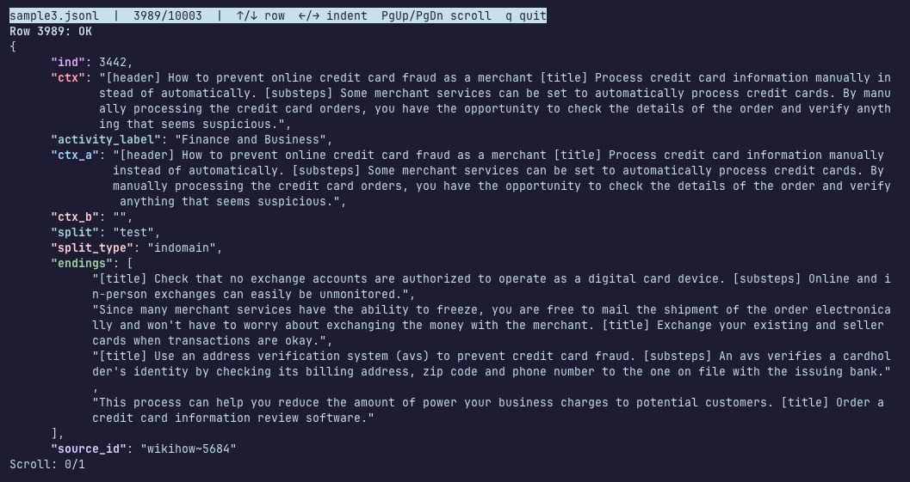

# jsonl-viewer

A CLI tool to manually view the rows of a JSON lines file.


Sample JSONL entry fron the HellaSwag dataset.

## Requirements

`curses` and Python (>= 3.9) must be installed.

## Installation

After cloning the repository, run the following installation command:

```
$ git clone https://github.com/looooonk/jsonl-viewer.git
$ cd jsonl-viewer
$ python -m pip install -e .
```

## Usage

To view the contents of a JSON lines file, use

```
jsonl PATH_TO_FILE
```

To view a summary of a JSON lines file, use

```
jsonl PATH_TO_FILE -b
```

To view more information, use

```
jsonl -h
```

## Themes

You can specify a certain color theme using the `-t` argument.

Currently, 4 themes are supported:
- `catppuccin-frappe`
- `catppuccin-latte`
- `catppuccin-macchiato`
- `catppuccin-mocha`

If not specified, the theme will default to `catppuccin-mocha`.

You may add additional themes at `./json_cli/themes/`.

## Commands
For easy navigation, you can press `:` in the curses window to enter a command, much like vim.

Currently, the following commands are supported:

- Jump to certain line number (1-indexed):
    ```
    :goto INT
    ```

Other commands, including `find` with regular expressions and aggregation are in development.